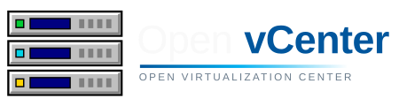

<h1 align="center">
  <a href="https://openvcenter.com/">
    
  </a>
</h1>

A web console for managing VMs. Currently its supports **Microsoft Hyper-V** clusters, hosts and virtual
machines - browse your inventory, run VM lifecycle and power actions, edit
hardware, manage templates and ISOs, and open a VM console straight from the
browser.
{: .fs-6 .fw-300 }

[View on GitHub](https://github.com/claudio-azevedo/Open-vCenter){: .btn .btn-primary .mr-2 }
[Architecture](architecture){: .btn }

---

## What it is

OVC is a distributed system with three first-party components:

| Component        | Role                                                                                  |
| ---------------- | ------------------------------------------------------------------------------------- |
| **ovc-frontend** | React 19 / TanStack Start SSR web UI. The only REST client.                           |
| **ovc-backend**  | FastAPI REST API **+** a RabbitMQ worker. Owns PostgreSQL and Valkey.                 |
| **ovc-agent**    | A Go Windows service on every Hyper-V host. Executes the work, replies over RabbitMQ. |

The backend and the agents **never talk directly** - every operation flows
through RabbitMQ as an `AgentRequest` / `AgentResponse` pair, and every mutating
operation is tracked as an asynchronous `Task`.

```
Browser ──REST──▶ ovc-frontend ──REST /api/*──▶ ovc-backend ──RabbitMQ──▶ ovc-agent (per host)
                                                     │
                                            PostgreSQL + Valkey
```

## Where to go next

- **[Architecture](architecture)** - how a request flows end to end, queues, task lifecycle.
- **[Components](components)** - each repository, its stack and responsibilities.
- **[Dependencies](dependencies)** - PostgreSQL, RabbitMQ, Valkey, OIDC, guacd.
- **[Running in dev mode](running)** - local development stack and per-host agent setup.
- **[Docker Compose](docker-compose)** - the whole stack as containers, one compose file.
- **[Kubernetes](kubernetes)** - the whole stack on a single-node k3s cluster.
- **[Screenshots](screenshots)** - the console in action.

## License

Licensed under the **Apache License 2.0**.
