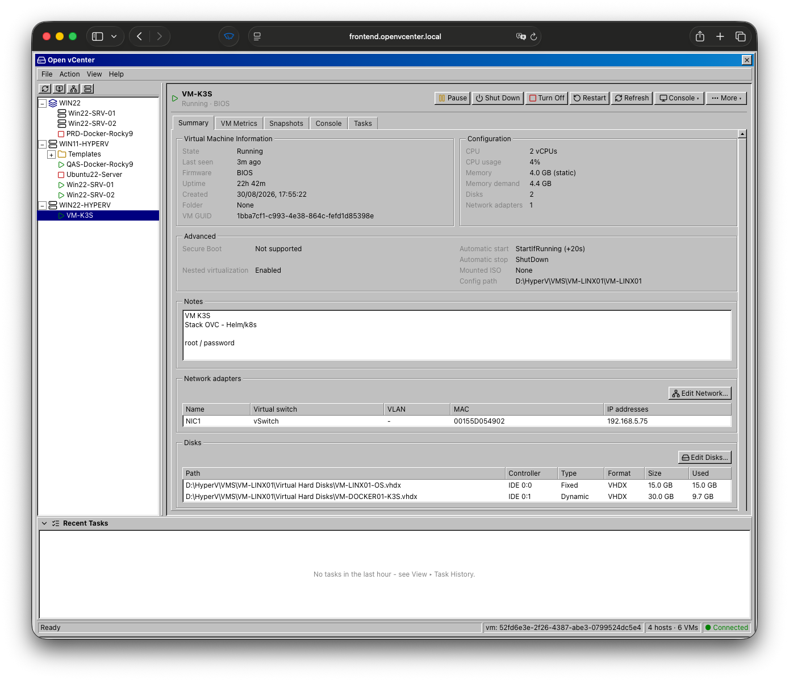
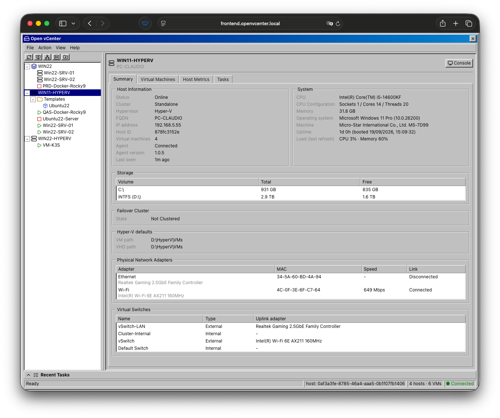
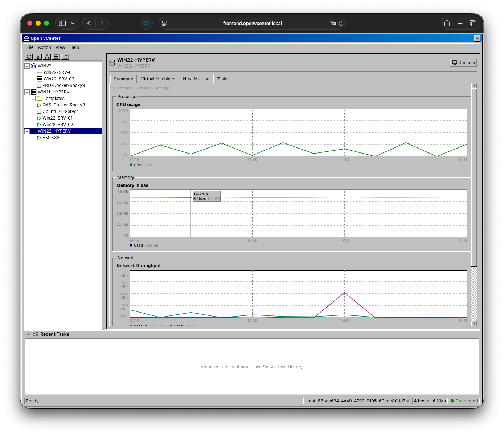
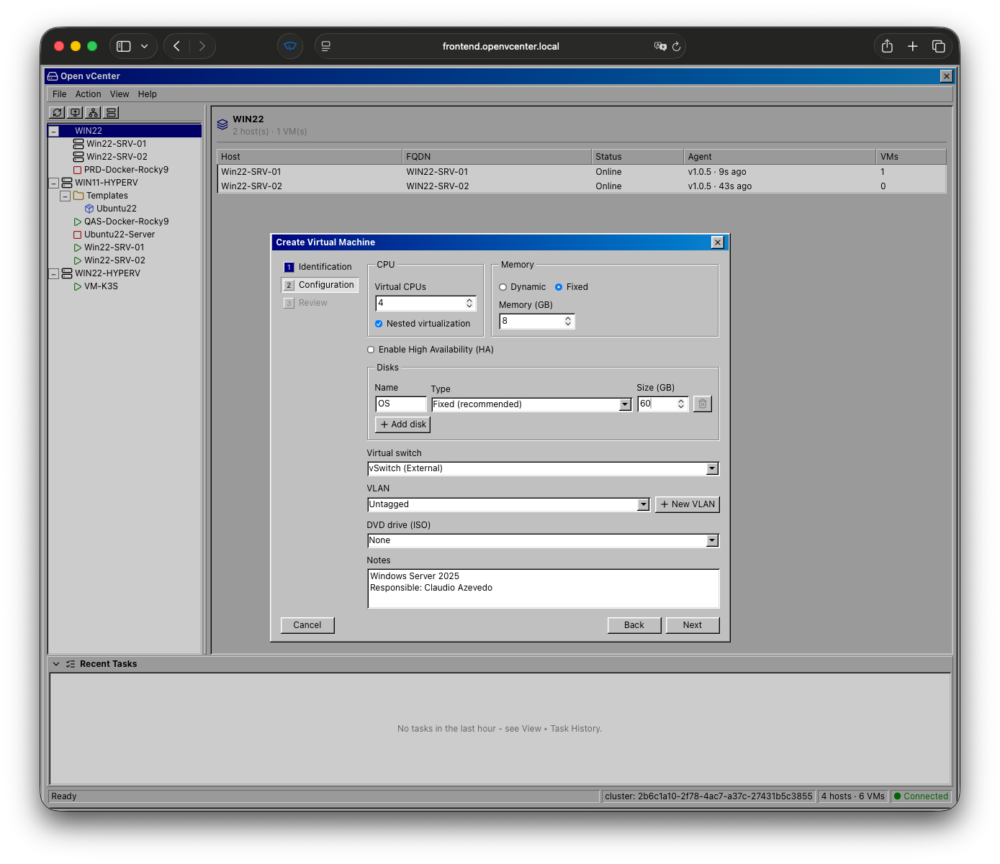
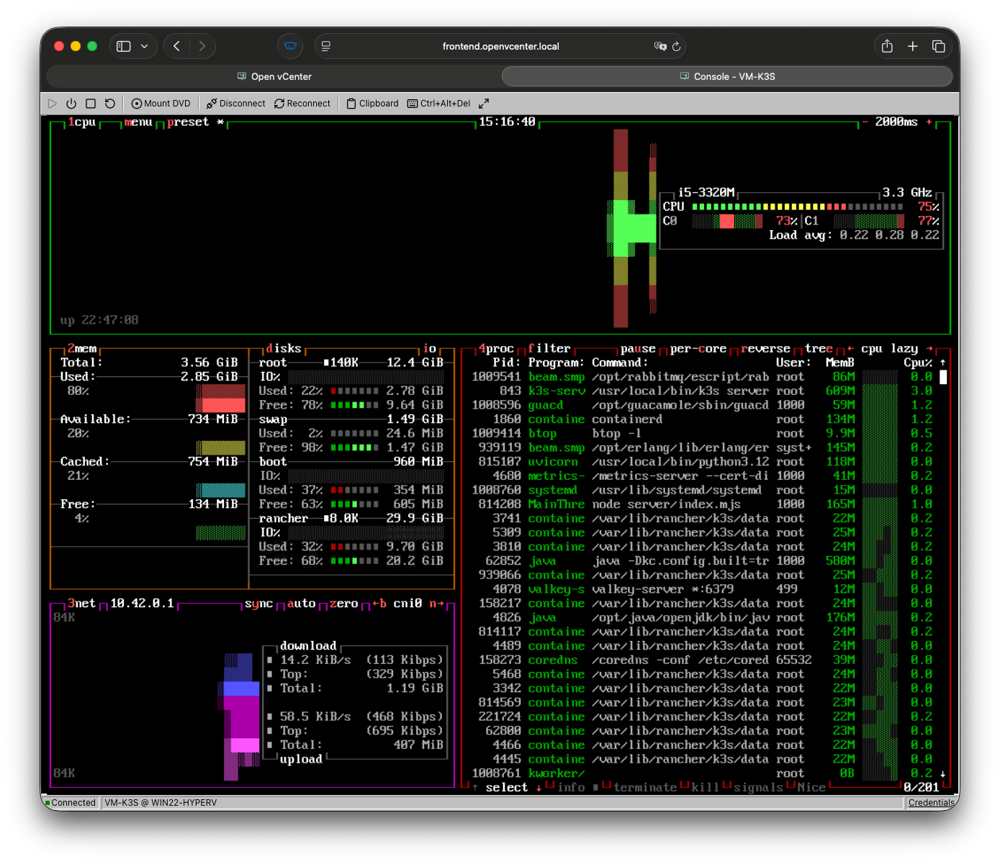

# Screenshots

**VM Selected > Details Panel**

<figure class="text-center">
  
  <figcaption>VM tree with the VM detail tabs on the right.</figcaption>
</figure>

**Host Selected > Details Panel**

<figure class="text-center">
  
  <figcaption>VM tree with the Host detail tabs on the right.</figcaption>
</figure>

**Host Selected > Metrics Panel**

<figure class="text-center">
  
  <figcaption>VM tree with the Host metrics tabs on the right.</figcaption>
</figure>

**VM Create Dialog**

<figure class="text-center">
  
  <figcaption>VM Creation Dialog, can change CPU/Memory/Disks/Network.</figcaption>
</figure>

**VM HTML5 Console**

<figure class="text-center">
  
  <figcaption>The browser RDP / vmconnect console embedded.</figcaption>
</figure>
